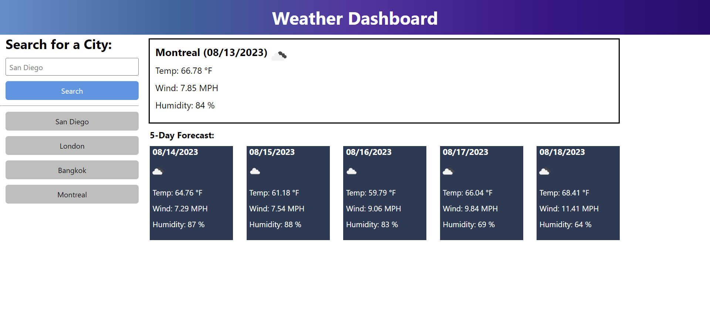

# five-day-forecast

## Description

This application shows the weather of the current date and next five days to come.

## Table of Contents

- [Installation](#installation)
- [Usage](#usage)
- [Credits](#credits)
- [License](#license)

## Installation

Not necessary

## Usage

Type in the city of the weather you want to see, then click the search button. The weather of the current day will appear for the city and the weather for the next five days will appear in the '5-Day Forecast' section.

## Credits

Provided answer to reason api was being blocked:
https://stackoverflow.com/questions/52130918/web-api-error-this-request-has-been-blocked-the-content-must-be-served-over-h)https://stackoverflow.com/questions/52130918/web-api-error-this-request-has-been-blocked-the-content-must-be-served-over-h

## License

MIT License
